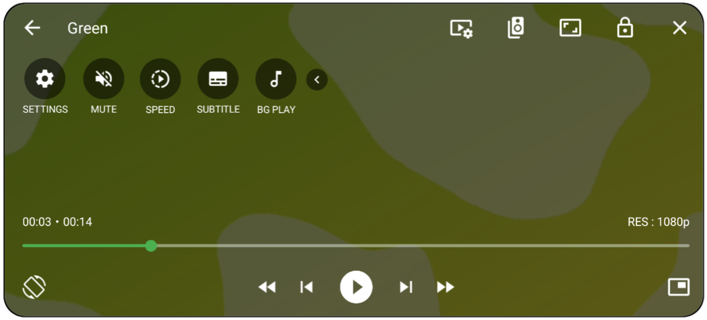

  

# SUic Player

Simple Useful Interesting Cool (SUic) Video Player and Support Audio/Subtitle/Video Multiple Tracks and Online Stream Supported Video Player. Smooth video performance video player and audios all folder discover available in this SUic Player Application and this application made by Soiad Mahedi from Bangladesh

SUic Player Android Audio and Video Player based on AndroidX [Media3](https://github.com/androidx/media) ExoPlayer Google Official Media Library. But it use Device Video Decoder and ExoPlayer's FFMEG Extension and Device Decoder from Old Video Player.

# Download & Availability 

Current SUic Player Version : 1.8 SM

# Supported formats

- Audio : Vorbis, Opus, FLAC, ALAC, PCM/WAVE (u-law, A-law), MP1, MP2, MP3, AMR (NB, WB), AAC (LC, ELD, HE; xHE on Android 9+), AC-3, E-AC-3, DTS, DTS-HD, TrueHD etc.
- Video : H.263, H.264 AVC (Baseline Profile; Main Profile on Android 6+), H.265 HEVC, MPEG-4 SP, VP8, VP9, AV1 etc.
- Containers : MP4, MOV, WebM, MKV, Ogg, MPEG-TS, MPEG-PS, FLV etc.
- Streaming : DASH, HLS, SmoothStreaming, RTSP, HTTP & HTTPS Stream etc.
- Subtitles: SRT, SSA, TTML, VTT etc.

# Features 

- Multiple Audio/Subtitle Tracks 
- Multiple Video Quality Tracks Support 
- Media Playback Speed Control
- Pinch Zoom and Resize (Fit/Crop/Stretch)
- Horizontal Swipe Gesture Control to quickly Media Seek Position.
- Left Vertical Swipe Gesture Control to Volume
- Right Vertical Swipe Gesture Control to Brightness
- PiP (Picture in Picture) Mini Player Support
- Touch Lock and Unlock 
- Double Tap to Play/Pause 
- Automatic Orientation Rotate According to Video Frame and Sensor.
- Music Playback Notification and Music Action and Background playback supported (listen to music with the app minimized).
- Action Button (Play/Pause, Next and Previous Media from Folder)

# Permissions & Access 

### Required Permission 
Storage / All Files Access : Necessary to scan and access all media files and subtitles on primary and external storage, including those not supported by Android Media Scanner. 
### Optional Permission 
Notification : When BG PLAY feature enabled to Playback state and action watching in notification from SUic Player.

# Developer Details 

SUic Player Developed by Md. Mehedi Hassan Rabbani and his Brand Name is Soiad Mahedi. Bangladeshi Software Developer and Digital Content Creator.

- Facebook : https://facebook.com/soiadmahediofficial
- Twitter : https://twitter.com/soiadmahedi
- Instagram : https://instagram.com/soiadmahedi
- Soiad Mahedi official blogspot site : https://soiadmahedi.blogspot.com

*** If you are facing "package file is invalid" error, please install it again from product home page (https://sites.google.com/view/suicplayer/download) 

If you have any question, Please contact us from my Gmail address (mahedisbusiness@gmail.com)

---

  

