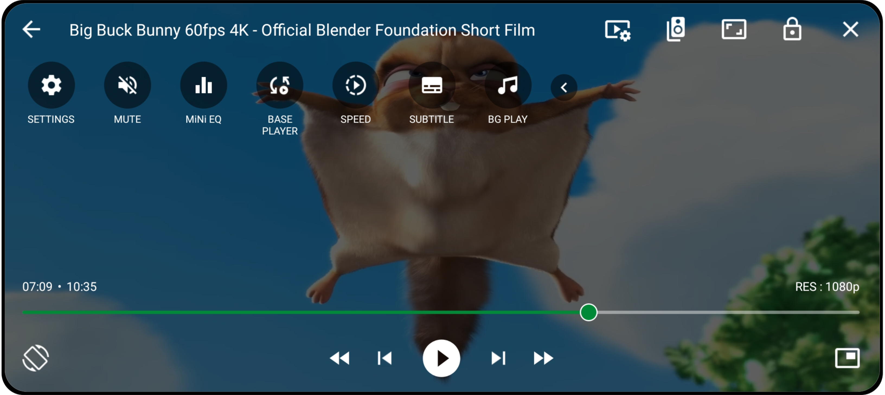

  

<h1 align="center">SUic Player</h1>

  <i>Simple • Useful • Interesting • Cool</i> 
  A powerful and smooth Android media player built on Media3 (ExoPlayer).

  Developed by <b>Soiad Mahedi</b> from Bangladesh 🇧🇩

---

## 🎬 About the App

**SUic Player** is a versatile and powerful media player for Android Phone and Android TV. Built on the modern **Media3 (formerly ExoPlayer)** library, it's designed for high-performance, high-fidelity playback of your entire media library.

It leverages the **Media3 FFmpeg extension** to support a vast range of audio formats, including special codecs like **AC3, E-AC3, DTS, DTS-HD, and TrueHD**. SUic Player was also created to solve a common problem: it **properly syncs audio with video** when using Bluetooth earphones or speakers.

---

## 📲 Download & Availability (Latest: 2.0 SM (11))

  
  
  
  
  
  

---

## 🌟 Key Features

* **Advanced Audio Support:** Native playback for **AC3, E-AC3, DTS, DTS-HD, and TrueHD** formats.
* **Bluetooth Audio Sync:** No more frustrating audio lag on Bluetooth headphones or speakers.
* **Complete Gesture Control:**
    * **Seek:** Swipe horizontally.
    * **Volume:** Swipe vertically on the right side.
    * **Brightness:** Swipe vertically on the left side.
    * **Playback Speed:** Long press on the left (slow) or right (fast).
    * **Pinch-to-Zoom:** Zoom and pan the video.
* **All-in-One Media Hub:** Manage local Video, Audio, and Network Streams in one place.
* **Full Player Controls:** Background play, Picture-in-Picture (PiP), audio/video track selection, equalizer, and control lock.
* **Subtitle Support:** Load external files (`.srt`, `.ssa`, `.ass`) or use internal tracks.
* **File Management:** Easily browse, play, share, rename, and delete your files.

---

## 📸 Screenshots

  
  

---

## 📁 Supported Formats

| Type | Formats |
| :--- | :--- |
| **Audio** | Vorbis, Opus, FLAC, ALAC, PCM/WAVE, MP1, MP2, MP3, AMR (NB/WB), AAC (LC/HE/ELD/xHE), AC-3, E-AC3, DTS, DTS-HD, TrueHD |
| **Video** | H.263, H.264 AVC, H.265 HEVC, MPEG-4 SP, VP8, VP9, AV1 |
| **Containers** | MP4, MOV, WebM, MKV, Ogg, MPEG-TS, MPEG-PS, FLV, AVI (limited) |
| **Streaming** | DASH, HLS, SmoothStreaming, RTSP, HTTP/S |
| **Subtitles** | SRT, SSA/ASS, TTML, VTT, DVB |

---

## 🌍 Supported Languages

SUic Player is available in over 20 languages thanks to community contributions.

| | | | |
| :--- | :--- | :--- | :--- |
| English | Bangla | Sylheti | Arabic |
| African | Hindi | Urdu | Korean |
| Persian | Chinese (Simp) | Chinese (Trad) | Spanish (Spain) |
| Tamil | Telegu | Turkish | Malay |
| Indonesian | Pashto | Kurdish | Hausa |
| Somali | Kazakh | Uzbek | Russian |

---

## 🔐 Permissions Explained

| Permission | Why it's needed |
| :--- | :--- |
| `INTERNET` | To play network streams and show ads. |
| `MANAGE_EXTERNAL_STORAGE` | To find, play, and manage your local media files. |
| `POST_NOTIFICATIONS` | To show the media playback controls in the notification bar. |
| `FOREGROUND_SERVICE_MEDIA_PLAYBACK` | To allow audio to play in the background. |
| `com.google.android.gms.permission.AD_ID` | To provide relevant advertisements (Google AdMob). |

---

## 🤝 Contributing & Feedback

SUic Player is **not an open-source project**, and the full source code is private.

However, we welcome contributions to help improve the app for everyone!

* **Translations:** You can help translate the app into your language. Please check the **[strings.xml - language-strings](https://github.com/soiadmahedi/SUic-Player/tree/main/language-strings)** file (example link, update it to your file path) and submit an issue or pull request with your translations.
* **Bug Reports & Improvements:** If you find a bug or have an idea, please [open an issue](https://github.com/soiadmahedi/SUic-Player/issues) on this repository. If you have a specific code improvement for a utility (like the `utility.java` files), feel free to share it in an issue.

---

## 👨‍💻 Developer Info

**Soiad Mahedi** _Bangladeshi Software Developer and Digital Content Creator_

- 🌐 [Website](https://soiadmahedi.top)
- 🌐 [Blogspot Website](https://soiadmahedi.blogspot.com)
- 📧 mahedisbusiness@gmail.com
- 📘 [Facebook](https://facebook.com/soiadmahediofficial)  
- 🐦 [Twitter/X](https://twitter.com/soiadmahedi)  
- 📷 [Instagram](https://instagram.com/soiadmahedi)  

> 💡 If you get a _“package file is invalid”_ error, please download from the official page:  
> [https://sites.google.com/view/suicplayer/download](https://sites.google.com/view/suicplayer/download)

---

  

